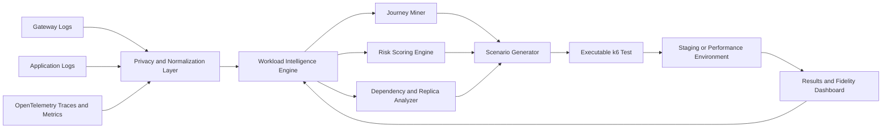
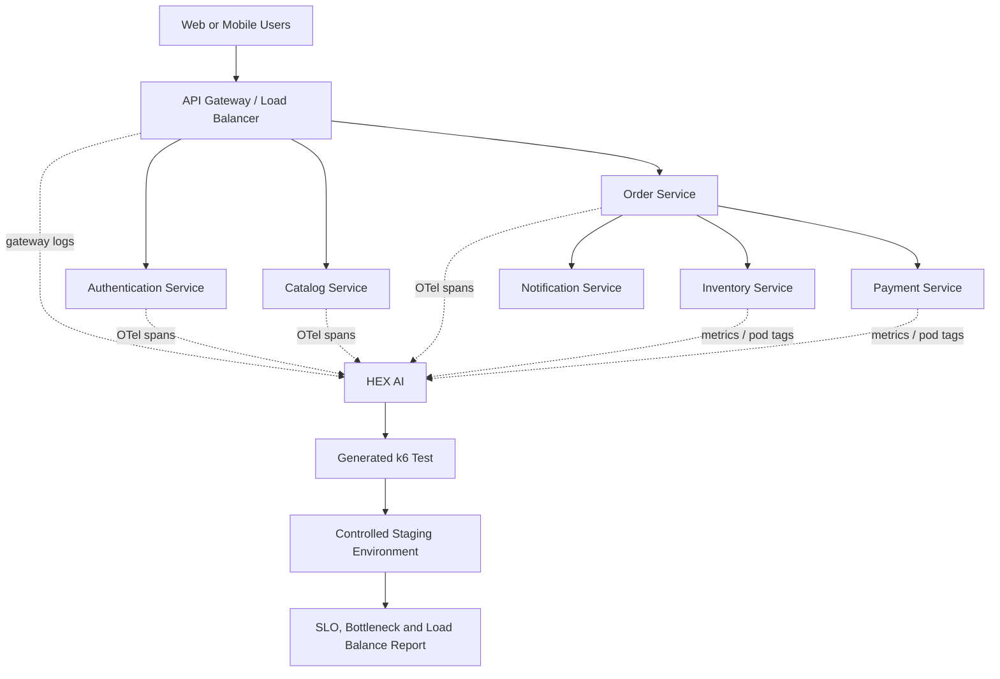
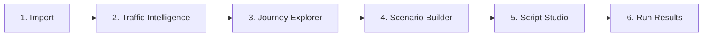
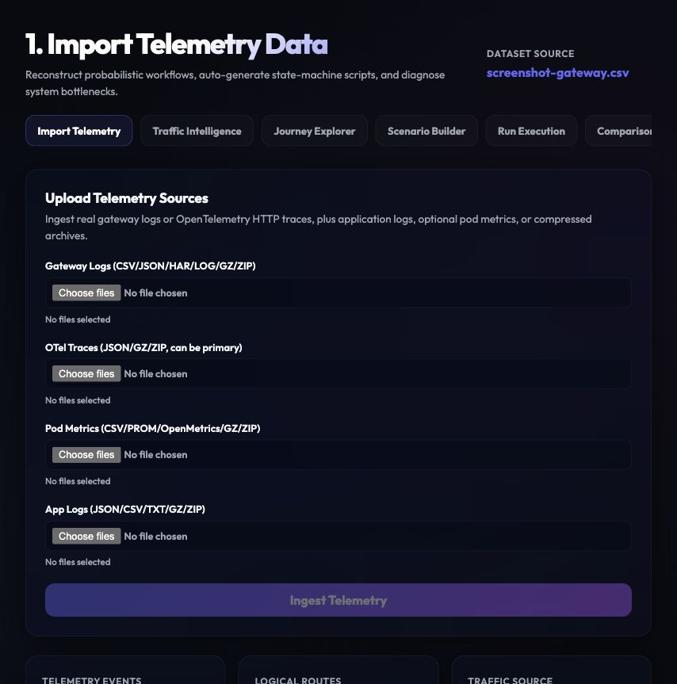
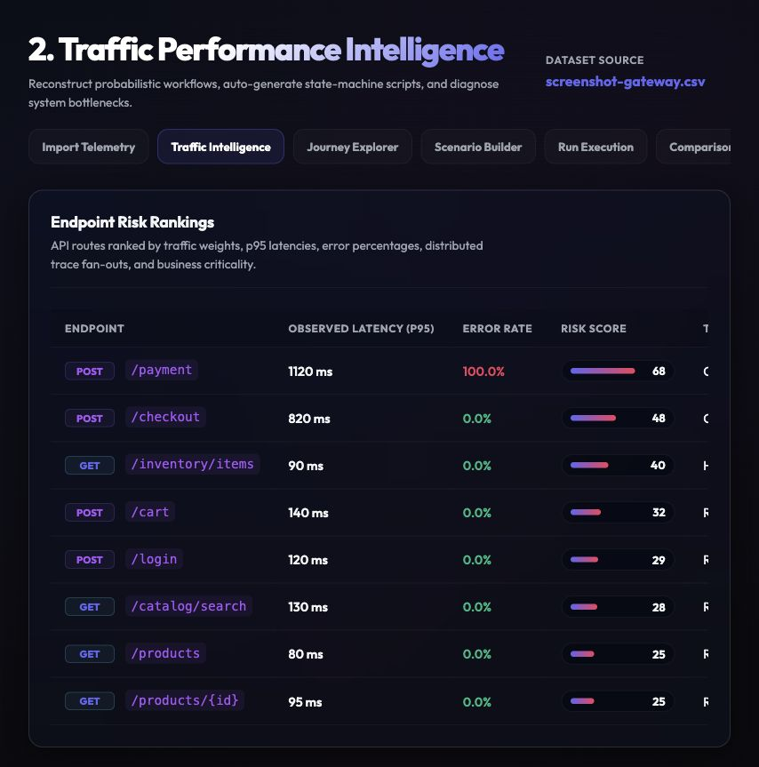
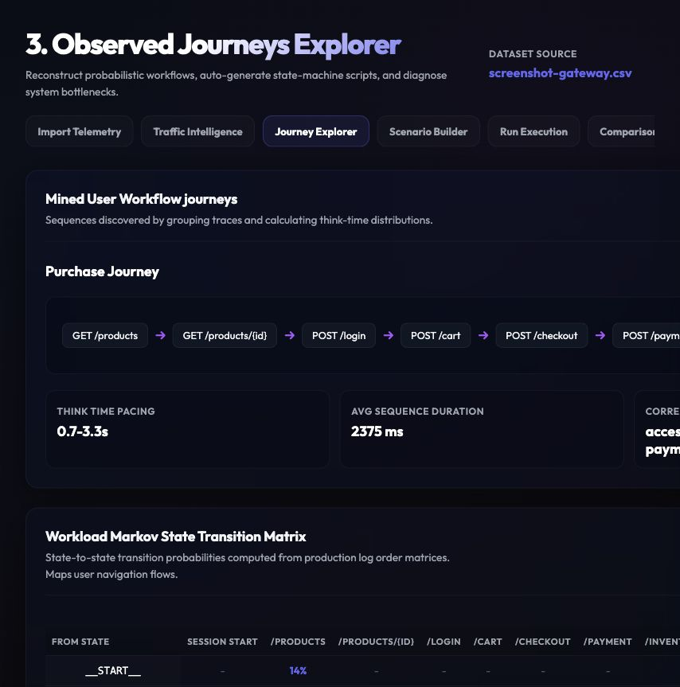
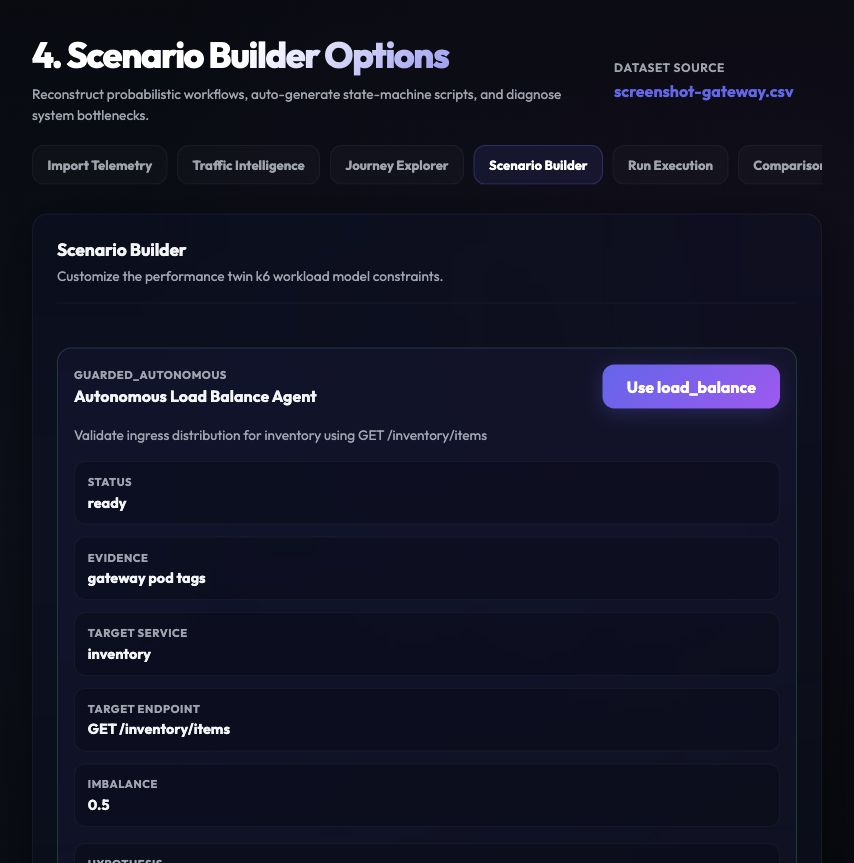
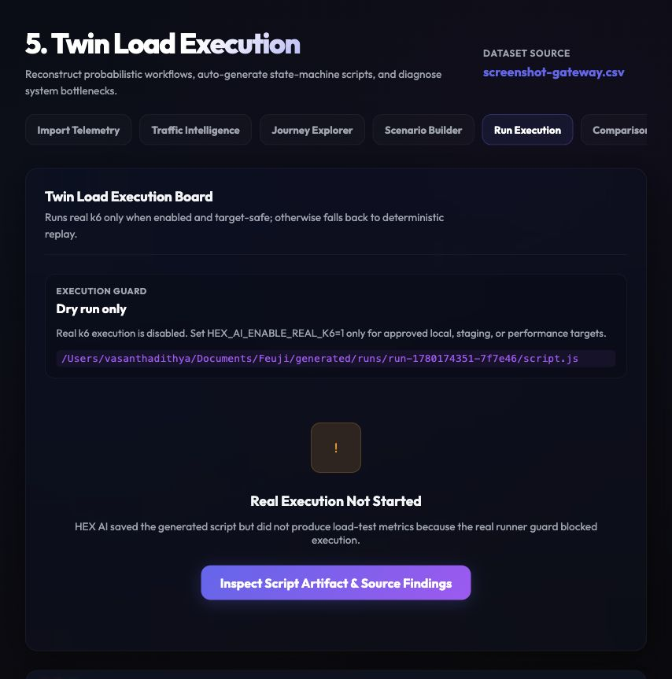
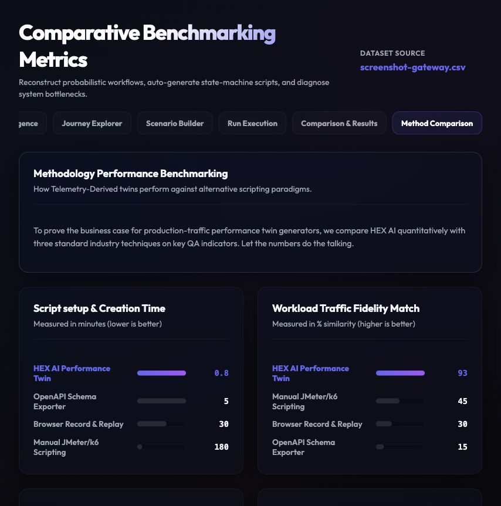

# HEX AI

### Autonomous Performance Digital Twin from Production Telemetry

**Team H5X | Feuji AI Hackathon 2026**

> Convert sanitized production traffic patterns into realistic, executable and
> explainable load tests for enterprise applications.

## Challenge

**Automated Load Test Script Generation from Production Traffic**

Traditional performance testing depends heavily on engineers manually choosing
APIs, recording flows, correlating dynamic values and tuning traffic profiles.
These scripts can quickly become disconnected from real production behavior.

The challenge is to build a system that learns how an application is actually
used from available production telemetry and automatically produces realistic
load-testing scenarios.

## Our Solution

**HEX AI** creates a performance digital twin of an enterprise
application from sanitized API logs, OpenTelemetry traces and infrastructure
metrics. It discovers endpoint usage, reconstructs common user journeys,
prioritizes risky business flows and generates executable **k6** load tests.
After a test runs in a safe non-production environment, it compares the
generated workload with the learned production pattern and explains
bottlenecks or load-balancer imbalance.

```text
Observe -> Sanitize -> Learn -> Generate -> Execute Safely -> Validate -> Improve
```

## Current MVP

This repository now includes the first working HEX AI MVP slice:

| Layer | Status |
| --- | --- |
| React dashboard | Starts empty and requires uploaded telemetry |
| FastAPI backend | Implemented with upload analysis, scenario generation and run APIs |
| Analytics engine | Endpoint risk ranking, journey mining, dependency graph and replica imbalance |
| Input resilience | Gateway logs or OpenTelemetry HTTP traces as primary traffic source, Prometheus/OpenMetrics or CSV pod metrics, multiple files per source, `.gz`/`.zip` telemetry exports, application logs, data-quality warnings and invalid upload rejection |
| Script generation | k6 Markov state-machine script generated from observed traffic transitions and safe runtime correlation rules |
| Autonomous agent | Load Balance Agent observes pod metrics or gateway pod tags, selects `load_balance`, and generates a focused k6 probe for the hotspot endpoint |
| Execution guardrails | Saves script, summary, event and log artifacts under `generated/`; runs real k6 only when explicitly enabled for safe targets |

### Run Locally

Install dependencies:

```bash
npm install
python3 -m venv .venv
.venv/bin/python -m pip install -r backend/requirements.txt
```

Start the API:

```bash
.venv/bin/python -m uvicorn backend.app.main:app --reload --port 8000
```

Optional Gemini configuration:

```bash
cp .env.example .env.local
# Edit .env.local with your local Gemini key.
.venv/bin/python -m uvicorn backend.app.main:app --reload --port 8000 --env-file .env.local
```

The current MVP works without Gemini. When `.env.local` provides
`GEMINI_API_KEY` or `HEX_AI_LLM_API_KEY`, the API calls Gemini with a compact
sanitized evidence summary and returns demo-ready guidance for risk, scenario
rationale and script review. The deterministic telemetry engine still owns
analysis, scenario selection and k6 generation, so the project continues to
work if the external LLM is unavailable.

Start the dashboard in another terminal:

```bash
npm run dev
```

Open:

```text
http://127.0.0.1:5173
```

For a fast demo, click **Load Sample Telemetry** on the import screen. The
bundled files under `public/sample-telemetry/` exercise HAR correlation,
OpenTelemetry traces, pod imbalance metrics and application-log explanation
through the same upload API used for user-provided telemetry.
Click **Load Sample ZIPs** to run the same flow through bounded ZIP archive
decompression for each telemetry source.

Useful checks:

```bash
npm run build
.venv/bin/python -m compileall backend
npm run test:backend
curl http://127.0.0.1:8000/api/health
```

### Latest Verification Results

Validated locally on **2026-05-31**:

| Check | Result |
| --- | --- |
| `npm run build` | Passed: Vite production build completed |
| `npm run check:backend` | Passed: backend Python files compiled successfully |
| `npm run test:backend` | Passed: 18 backend tests passed |
| `curl http://127.0.0.1:8000/api/health` | Passed: API returned `{"status":"ok","service":"hex-ai-api"}` |
| `curl -I http://127.0.0.1:5173/` | Passed: dashboard route returned HTTP 200 after starting Vite dev server |
| `git check-ignore` | Passed: `prompt.md`, `Update.md`, `generated/`, `dist/`, `node_modules/`, `.venv/` and `.pytest_cache/` are ignored |

Real k6 execution is intentionally guarded. To execute a generated script
against a local/private/allowlisted performance environment, install `k6` and
start the backend with:

```bash
HEX_AI_ENABLE_REAL_K6=1 .venv/bin/python -m uvicorn backend.app.main:app --reload --port 8000
```

External staging hosts must be explicitly allowlisted with
`HEX_AI_TARGET_ALLOWLIST=staging.example.com`. Otherwise HEX AI saves the
generated k6 script but does not claim load-test results.

Runtime test data stays outside generated scripts. Pass staging-safe values
when running k6:

```bash
BASE_URL=http://localhost:8080 \
HEX_AI_USERNAME="$STAGING_USER" \
HEX_AI_PASSWORD="$STAGING_PASSWORD" \
HEX_AI_PRODUCTID="$STAGING_PRODUCT_ID" \
HEX_AI_AUTH_TOKEN="$STAGING_AUTH_TOKEN" \
k6 run generated/runs/<run-id>/script.js
```

For richer payloads, set `HEX_AI_TEST_DATA_JSON` from a secret manager or CI
variable. The generated script also reads individual variables such as
`HEX_AI_USERNAME`, `HEX_AI_PASSWORD`, `HEX_AI_PRODUCTID`,
`HEX_AI_PAYMENTMETHOD`, `HEX_AI_CARTID`, and `HEX_AI_ORDERID`.

Secured staging APIs can be tested without editing generated scripts:

```bash
HEX_AI_AUTH_TOKEN="$STAGING_AUTH_TOKEN" \
HEX_AI_AUTH_SCHEME=Bearer \
HEX_AI_API_KEY="$STAGING_API_KEY" \
HEX_AI_API_KEY_HEADER=x-api-key \
HEX_AI_EXTRA_HEADERS_JSON='{"x-tenant-id":"perf-tenant"}' \
k6 run generated/runs/<run-id>/script.js
```

HEX AI does not embed demo usernames, passwords, fixed product IDs, payment
values, auth tokens, API keys or tenant headers in the script artifact.

### Core Value

| Problem | HEX AI Response |
| --- | --- |
| Manual test scripts take time to prepare | Generates runnable k6 scenarios from telemetry |
| Testing only the busiest API misses important risk | Ranks APIs using latency, errors, dependency fan-out and business criticality |
| Recorded tests represent only a few selected user actions | Mines repeated journeys across many traces or sessions |
| Dynamic IDs and tokens break generated scripts | Detects HAR response-to-request correlations such as `cartId`, `csrfToken`, `orderId` and `accessToken` without storing raw values |
| Load tests provide results but not realism evidence | Separates telemetry readiness, generated workload target mix and real k6 results |
| Average latency hides routing issues | Detects per-pod traffic imbalance from pod metrics or gateway served-pod tags |

## Why This Is Different

HEX AI is not just an AI code generator. Script generation is one stage
inside a measurable and governed quality engineering workflow.

1. **Production-derived workload model:** the test mix is learned from
   telemetry, instead of being guessed or defined only from a single browser
   recording.
2. **Risk-aware testing:** a low-volume checkout or payment endpoint can be
   selected ahead of a high-volume read-only API if traces show higher business
   or dependency risk.
3. **Trace-backed diagnosis:** distributed traces connect a slow public API to
   downstream services such as inventory, payment or a database.
4. **Load-distribution validation:** the product checks whether replicas share
   traffic fairly from pod metrics or gateway `pod_name`/instance tags, not
   only whether response times are acceptable.
5. **Fidelity measurement:** generated traffic is compared with the source
   behavior so the test has evidence of realism.

## End-to-End Product Flow



## Enterprise Working Model

In a Feuji client-style enterprise application, traffic commonly passes
through an API gateway or load balancer to multiple microservices and
replicas. HEX AI reads the observability evidence already generated by
that system and turns it into QA action.



### Working Steps

| Step | Engine Activity | Output |
| --- | --- | --- |
| 1. Ingest | Accept API gateway CSV/JSON, OTLP trace JSON and optional pod metrics | Validated dataset summary |
| 2. Protect | Mask secrets and normalize high-cardinality identifiers | Privacy-safe event records |
| 3. Analyze | Aggregate route traffic, latency, error rates and peak periods | Endpoint intelligence |
| 4. Mine | Sequence traces or sessions into repeated workflows | User journey catalogue |
| 5. Prioritize | Score route and service risk | Test candidate ranking |
| 6. Correlate | Find response values reused by subsequent requests | Dynamic extractor rules |
| 7. Generate | Convert workload model into k6 scenarios and thresholds | Reviewable test script |
| 8. Execute | Run only against an approved test target with load caps | Test metrics and traces |
| 9. Verify | Compare actual run mix with learned production mix | Fidelity and QA report |

## MVP Scope

The MVP delivers one complete and demonstrable product journey rather than
many unfinished integrations.

### Included in MVP

| Capability | MVP Implementation |
| --- | --- |
| Telemetry upload | Gateway log CSV/JSON and OpenTelemetry trace JSON |
| Sanitization | Header/token masking and path parameter replacement |
| Endpoint dashboard | Request volume, p95 latency, errors and peak rate |
| Journey discovery | Trace/session sequence grouping with observed shares |
| Dependency view | Service relationship graph from trace parent-child spans |
| Risk ranking | Weighted traffic, latency, error, fan-out and criticality score |
| Correlation | Detect common dynamic values in dependent journey calls |
| Script generation | k6 JavaScript with scenarios, checks and thresholds |
| Execution | Script artifact by default; real k6 subprocess when enabled and target-safe |
| Validation | Fidelity score, SLO failures and optional pod imbalance report |

### Out of Scope for the First MVP

| Deferred Capability | Reason |
| --- | --- |
| Direct production test execution | Unsafe and unnecessary for demonstrating value |
| JMeter and Gatling exports | One reliable k6 exporter proves the workflow |
| Live vendor-specific APM integrations | Uploaded standard telemetry keeps the MVP portable |
| Automatic remediation of infrastructure | Product recommends actions; it does not modify production |

## Dashboard Experience

HEX AI is designed as a dashboard-led product. A performance engineer or
QA lead can move from telemetry upload to a test finding in a single workflow.



### App Screenshots

Captured from the current HEX AI MVP with telemetry loaded through the
standard upload analysis flow.

| Stage | Screenshot |
| --- | --- |
| 1. Import Telemetry |  |
| 2. Traffic Intelligence |  |
| 3. Journey Explorer |  |
| 4. Scenario Builder |  |
| 5. Run Execution |  |
| 7. Method Comparison |  |

### 1. Import and Data Quality

The user uploads telemetry and immediately sees whether the dataset supports
endpoint analysis, journey discovery and replica validation.

| Display Card | Example Value |
| --- | ---: |
| Requests Imported | 128,420 |
| Logical Routes Found | 24 |
| Complete Traces | 18,203 |
| Sensitive Fields Masked | 417 |
| Journey Detection | Available |
| Replica Analysis | Available |

If the data contains no trace or session identifiers, the product explicitly
falls back to endpoint-mix test generation instead of claiming to reconstruct
user journeys.

### 2. Traffic Intelligence

This page shows which APIs are popular, slow, unreliable or risky.

| Endpoint | Traffic Share | p95 Latency | Error Rate | Fan-Out | Risk Score | Key Finding |
| --- | ---: | ---: | ---: | ---: | ---: | --- |
| `GET /products` | 42% | 120 ms | 0.2% | 1 | 44 | Highest volume |
| `POST /cart` | 12% | 210 ms | 0.7% | 2 | 45 | Dynamic data required |
| `POST /checkout` | 8% | 820 ms | 2.5% | 6 | 89 | Critical and slow |
| `POST /payment` | 3% | 1,100 ms | 4.1% | 4 | 94 | Critical failure risk |

### 3. Journey Explorer

The engine normalizes resource IDs and groups repeated endpoint sequences:

| Journey | Example Sequence | Observed Share | Testing Relevance |
| --- | --- | ---: | --- |
| Browse | `GET /products -> GET /products/{id}` | 58% | Normal high-volume behavior |
| Purchase | `POST /login -> POST /cart -> POST /checkout -> POST /payment` | 17% | Revenue-critical journey |
| Order Tracking | `POST /login -> GET /orders/{id} -> GET /tracking/{id}` | 14% | Authenticated read workflow |
| Abandoned Cart | `GET /products/{id} -> POST /cart` | 11% | Incomplete customer flow |

For each journey, the UI displays the observed think-time distribution,
completion latency, dynamic values and most delayed downstream service.

### 4. Scenario Builder

The user selects a test purpose and the system fills in a traffic model from
the learned telemetry.

| Test Mode | Purpose |
| --- | --- |
| Production Mirror | Reproduce normal journey and endpoint proportions |
| Peak Hour Replay | Reproduce the highest observed traffic interval |
| Spike Test | Validate behavior during a rapid demand surge |
| Breakpoint Test | Increase traffic until an SLO fails |
| Critical Journey Test | Stress a business-critical flow such as payment |
| Load Balance Test | Detect uneven routing across replicas |

### 5. Script Studio

Before execution, users can review the generated test and its evidence:

```javascript
export const options = {
  scenarios: {
    purchaseJourney: {
      executor: 'constant-arrival-rate',
      rate: 25,
      timeUnit: '1s',
      duration: '5m',
      exec: 'purchaseFlow',
    },
  },
  thresholds: {
    'http_req_duration{journey:checkout}': ['p(95)<800'],
    'http_req_failed{journey:checkout}': ['rate<0.01'],
  },
};
```

The explanation panel records why the script was created:

```text
Journey source: Product -> Cart -> Checkout -> Payment
Production share: 17%
Observed peak: 12 completed journeys/sec
Selected test load: 25 completed journeys/sec
Correlated fields: accessToken, cartId, orderId
Safety cap: 500 requests/sec against approved staging URL
```

### 6. Results and Recommendations

The results view combines performance outcomes with diagnostic evidence.

| Test Result Metric | Example Finding |
| --- | --- |
| First SLO failure | Checkout p95 exceeded 800 ms at 18 journeys/sec |
| Likely bottleneck | Inventory service contributed 62% of checkout trace duration |
| Error hotspot | Payment error rate reached 2.8% |
| Replica finding | `inventory-pod-1` processed 60% of replica traffic |
| Overall verdict | Test failed: downstream capacity and load distribution risk |

## Intelligence Engine

### Telemetry Inputs

| Input | Key Fields Used | Product Capability |
| --- | --- | --- |
| API gateway logs | timestamp, route, method, status, duration, trace/session ID | Traffic mix and peak load |
| Application logs | service, business event, error classification | Failure explanation |
| OpenTelemetry traces | trace ID, spans, service name, route, method, status, duration, parent span | Primary traffic reconstruction, journey and dependency analysis |
| Pod/instance metrics | CSV or Prometheus/OpenMetrics with service, pod, request count, CPU, latency, error rate | Replica balance analysis |
| Optional OpenAPI document | operations and schemas | Better request payload templates |

### Sanitization and Route Normalization

HEX AI does not need actual customer information. Before analytics or AI
assistance, fields are redacted or replaced by stable test-safe placeholders.

```text
Authorization: Bearer eyJ...             -> Authorization: {REDACTED}
/customers/98342/orders/711              -> /customers/{customerId}/orders/{orderId}
email=somebody@example.com               -> email={MASKED_EMAIL}
```

### Journey Mining

For an MVP, the journey algorithm is deterministic and explainable:

1. Group events using `trace_id` or anonymized `session_id`.
2. Sort requests by timestamp.
3. Normalize IDs in endpoint paths.
4. Form endpoint sequences for each session or trace.
5. Group identical and near-identical sequences.
6. Retain frequent and business-critical journeys.
7. Calculate transition shares and think-time distributions.

Future research extension: represent behavior as a probabilistic transition
model, following the direction of workload-extraction research such as
WESSBAS and LWS.

### Performance Risk Score

Selecting endpoints only by request count is incomplete. The MVP prioritizes
test scenarios through a transparent score:

```text
Risk Score =
  0.35 * normalized traffic share
+ 0.20 * normalized p95 latency
+ 0.15 * error rate
+ 0.15 * downstream fan-out
+ 0.15 * business criticality
```

Business criticality is configurable and must be reviewable by a QA lead.
For example, checkout and payment can carry higher impact even when their
traffic share is below product browsing.

### Dynamic Correlation

A production-like workflow often creates values that later requests require:

| Extracted Value | Source Request | Dependent Request |
| --- | --- | --- |
| `accessToken` | `POST /login` | Protected API requests |
| `cartId` | `POST /cart` | `POST /checkout` |
| `orderId` | `POST /checkout` | `POST /payment` and tracking |
| `csrfToken` | Session initialization | Form submission |

The MVP detects matching fingerprints when HAR response JSON bodies or headers
are reused by later request bodies or headers in the same session. The original
values are not stored in the dataset artifact. Generated k6 scripts receive a
reviewable `correlationRules` block and apply runtime extraction/injection
during execution.

### Production Fidelity Score

A generated script is useful only if its traffic resembles the behavior it was
created to represent.

| Fidelity Dimension | Measurement |
| --- | --- |
| Endpoint distribution | Similarity between route proportions in source and test run |
| Journey distribution | Difference between observed and executed workflow shares |
| Think-time distribution | Similarity between source pacing and generated pacing |
| Correlation success | Percentage of dynamic journeys completed without invalid data failures |
| SLO validity | Whether thresholds are evaluated on the intended business flow |

Example report:

| Measure | Score |
| --- | ---: |
| Endpoint Mix Similarity | 96% |
| Journey Mix Similarity | 92% |
| Think-Time Similarity | 88% |
| Dynamic Workflow Completion | 100% |
| Overall Fidelity Score | 93% |

### Load-Balance Validation

A service can have acceptable average latency while one replica is overloaded.
When pod metrics or gateway served-pod attributes are available, HEX AI
identifies this failure mode and automatically switches the suggested scenario
to a focused `load_balance` probe.

| Replica | Requests Served | CPU | p95 Latency | Finding |
| --- | ---: | ---: | ---: | --- |
| `inventory-pod-1` | 6,200 | 91% | 1,320 ms | Hotspot |
| `inventory-pod-2` | 2,180 | 37% | 390 ms | Underused |
| `inventory-pod-3` | 2,010 | 35% | 410 ms | Underused |

```text
Replica Imbalance = standard deviation(requests per replica)
                    / average(requests per replica)
```

High imbalance, combined with latency or CPU concentration, can point the QA
team toward sticky-session configuration, routing policy, connection reuse or
insufficient scaling investigation.

The generated k6 probe also records `hex_ai_replica_hits` from common
served-by response headers such as `x-pod-name`, `x-served-by`, or
`x-upstream-pod`. For real guarded k6 runs, HEX AI writes a JSON event artifact
and parses those hit samples into top replica, max share, imbalance score and
pass/fail load-balance evidence.

## Comparison With Other QA Techniques

### Technique Comparison for This Challenge

| QA Technique | How Tests Are Created | Strength | Gap for Production-Traffic Load Testing | HEX AI Advantage |
| --- | --- | --- | --- | --- |
| Manual k6/JMeter scripting | Engineer manually writes flows and data handling | Full human control | Slow creation and traffic assumptions can be inaccurate | Generates an evidence-backed first script with reviewability |
| Browser record-and-replay | Records one or several UI/API sessions | Quick for known functional flow | Does not represent aggregated production traffic patterns | Mines multiple real journey patterns and their observed proportions |
| OpenAPI-based API testing | Generates calls from endpoint schema | Broad endpoint coverage | Schema does not describe traffic, sequence or think time | Adds observed behavior, timing and workflow transitions |
| Top-endpoint stress testing | Tests highest-volume APIs | Simple and quick | Misses low-volume, high-impact checkout/payment paths | Adds risk ranking and business journey selection |
| APM monitoring alone | Observes production latency and errors | Finds existing operational problems | Does not automatically create pre-release tests | Turns trace evidence into repeatable test scenarios |
| Traffic replay | Replays captured requests | High traffic resemblance when feasible | Privacy, state and dynamic-value risks; difficult to control | Sanitizes, parameterizes and synthesizes safe executable scenarios |
| Functional automation reused for load | Scales existing scripted flows | Reuses QA assets | Functional scripts rarely model realistic workload shares | Builds load profiles from observed telemetry |
| **HEX AI** | Learns sanitized behavior and produces governed k6 tests | Realistic, trace-aware and measurable | Requires sufficient telemetry quality | Provides generation, diagnosis, fidelity scoring and feedback loop |

### Tool Capability Context

Existing performance tools are valuable execution or scripting platforms;
HEX AI is designed to complement them with telemetry-driven workload
intelligence.

| Existing Capability Category | Typical Value | HEX AI Addition |
| --- | --- | --- |
| Load test runners such as k6, JMeter or Gatling | Execute scripts at scale and report timings | Automatically defines realistic scenario mix and produces a k6 script |
| Recording-assisted script creation | Converts captured interactions into scripts | Learns repeated journeys across a telemetry dataset |
| Correlation support | Extracts values for a designed/recorded flow | Identifies correlation candidates while mining journeys |
| Observability platforms | Store metrics, logs and traces for analysis | Converts observability signals into new QA tests |
| CI performance gates | Fails builds against configured thresholds | Supplies trace-based scenarios and fidelity evidence for those gates |

## Research Foundation

HEX AI combines established research ideas with modern telemetry and load
testing tools.

| Foundation | Relevance to HEX AI |
| --- | --- |
| Workload extraction from logs | Supports learning behavior rather than manually inventing it |
| Session clustering | Enables grouping repeated user workflows |
| Probabilistic behavior models | Supports realistic journey transitions and proportions |
| OpenTelemetry semantic attributes | Provides normalized route, service and latency evidence |
| Arrival-rate load execution | Models traffic entering a system more naturally than fixed user loops for API workloads |
| Distribution similarity metrics | Quantifies whether generated traffic resembles source behavior |

### Research Questions

| Research Question | Evaluation Metric |
| --- | --- |
| Are telemetry-derived scripts closer to production behavior than top-endpoint tests? | Endpoint and journey fidelity scores |
| Does risk-aware selection discover important bottlenecks earlier? | Number of critical SLO failures found versus traffic-only baseline |
| Does correlation inference reduce manual work? | Generated journey replay success and manual edits required |
| Can replica analytics expose routing defects? | Detected imbalance compared with known introduced hotspot |
| How much setup time is reduced? | Time to runnable script compared with manual scripting |

## Implemented MVP Architecture

| Layer | Current Technology | Responsibility |
| --- | --- | --- |
| Web dashboard | React, Vite and custom CSS/SVG | Upload flow, visualizations and reports |
| API service | Python FastAPI | Dataset, scenario and run APIs |
| Local artifact store | JSON files under ignored `generated/` | Persist uploaded dataset analysis, generated scripts and run metadata |
| Processing | Python standard library aggregations | Cleaning, normalization, route grouping and risk scoring |
| Journey analytics | Session/trace sequence mining plus Markov transitions | Probabilistic workflow modelling |
| Trace graph | Parent-child span traversal | Service dependency analysis |
| Generator | Python k6 compiler | Predictable k6 Markov state-machine output |
| Load runner | Guarded Grafana k6 subprocess | Controlled scenario execution and thresholds |
| Telemetry standard | OpenTelemetry OTLP JSON | Portable trace input |
| Target system | Local, private, or allowlisted staging/performance endpoint | Safe system under test |

## API Sketch

| Endpoint | Purpose |
| --- | --- |
| `GET /api/health` | API liveness check |
| `POST /api/datasets/upload` | Upload gateway logs or OpenTelemetry HTTP traces, plus application logs and optional metrics |
| `POST /api/scenarios/generate` | Produce a k6 script from selected model |
| `POST /api/runs/start` | Start guarded real run or save blocked dry-run artifact |
| `GET /api/runs/{id}/status` | Return progress, logs, mode and live metrics |
| `GET /api/runs/{id}/results` | Return SLO, fidelity and diagnosis findings |

## Required Input Example

HEX AI accepts either gateway access logs or OpenTelemetry HTTP spans as the
primary traffic source. A gateway access log needs at least request
path/route/url, method, status, duration and timestamp. Trace or session IDs
are strongly recommended for journey mining. HAR browser/API exports and
enterprise log archives can also be uploaded as multiple files or as bounded
`.gz`/`.zip` archives under the same source; HEX AI parses each text file
independently before merging the normalized records:

```csv
timestamp,method,route,status,duration_ms,trace_id,session_id,service_name,pod_name
2026-05-27T10:00:01Z,GET,/products,200,104,t001,s001,catalog,catalog-pod-1
2026-05-27T10:00:03Z,POST,/cart,201,190,t001,s001,cart,cart-pod-1
2026-05-27T10:00:05Z,POST,/checkout,200,880,t001,s001,checkout,checkout-pod-1
2026-05-27T10:00:06Z,POST,/inventory/reserve,200,610,t001,s001,inventory,inventory-pod-1
2026-05-27T10:00:07Z,POST,/payment,200,330,t001,s001,payment,payment-pod-2
```

OpenTelemetry trace JSON can also stand alone when spans contain HTTP route,
method, status and duration attributes such as `http.route`,
`http.request.method` and `http.response.status_code`. In that mode HEX AI
derives endpoint traffic and journeys from the trace spans without inventing
gateway rows.

## Safety and Enterprise Governance

Production telemetry must be handled carefully. The MVP demonstrates the
following product rules:

| Control | Purpose |
| --- | --- |
| PII and secret masking before persistence | Redact emails, auth tokens, passwords, secrets, JWTs and card-like values from normalized analysis artifacts |
| Runtime test-data injection | Keep staging users, product IDs, order IDs and payment methods outside generated scripts through `HEX_AI_TEST_DATA_JSON` or `HEX_AI_*` variables |
| Runtime auth/header injection | Keep bearer tokens, API keys and tenant headers outside generated scripts through `HEX_AI_AUTH_TOKEN`, `HEX_AI_API_KEY` and `HEX_AI_EXTRA_HEADERS_JSON` |
| Environment allowlist | Prevent accidental load execution on production |
| Maximum request-rate cap | Limit unsafe load amplification |
| Threshold-based abort | Stop tests once critical conditions are breached |
| Human review of generated scripts | Keep execution understandable and auditable |
| Audit record for dataset and run | Support enterprise governance |

## Success Criteria

| Goal | MVP Evidence |
| --- | --- |
| Fast script creation | Runnable k6 script generated from uploaded telemetry |
| Realistic workload | Endpoint and journey target-mix report from uploaded telemetry |
| Less manual correlation effort | Dynamic value handling in a completed journey |
| Better bottleneck discovery | Trace-linked service diagnosis from uploaded traces and real k6 results when available |
| Load-balancer validation | Per-replica imbalance finding where metrics exist |
| Enterprise suitability | Sanitization, safe target enforcement and script review |

## Roadmap

| Stage | Capability |
| --- | --- |
| MVP | Uploaded telemetry, k6 generation, test execution and findings dashboard |
| Next | Drift monitoring that regenerates a scenario when production behavior changes |
| Next | Connectors for observability stores and CI/CD performance gates |
| Future | Additional exporters for JMeter and Gatling |
| Future | Assisted capacity recommendations and approved scaling experiments |

## References

1. OpenTelemetry, [OTLP Specification](https://opentelemetry.io/docs/specs/otlp/)
2. OpenTelemetry, [HTTP Span Semantic Conventions](https://opentelemetry.io/docs/specs/semconv/http/http-spans/)
3. Grafana k6, [Scenarios](https://grafana.com/docs/k6/latest/using-k6/scenarios/)
4. Grafana k6, [Thresholds](https://grafana.com/docs/k6/latest/using-k6/thresholds/)
5. Grafana k6, [OpenTelemetry Output](https://grafana.com/docs/k6/latest/results-output/real-time/opentelemetry/)
6. Voegele et al., [WESSBAS: Extraction of Probabilistic Workload Specifications for Load Testing](https://link.springer.com/article/10.1007/s10270-016-0566-5)
7. Han et al., [LWS: A Framework for Log-based Workload Simulation in Session-based Systems](https://www.sciencedirect.com/science/article/pii/S0164121223001309)

---

## Team H5X

**Feuji AI Hackathon 2026**

Building **HEX AI**, an autonomous and evidence-backed approach to
production-realistic performance testing and quality engineering.
